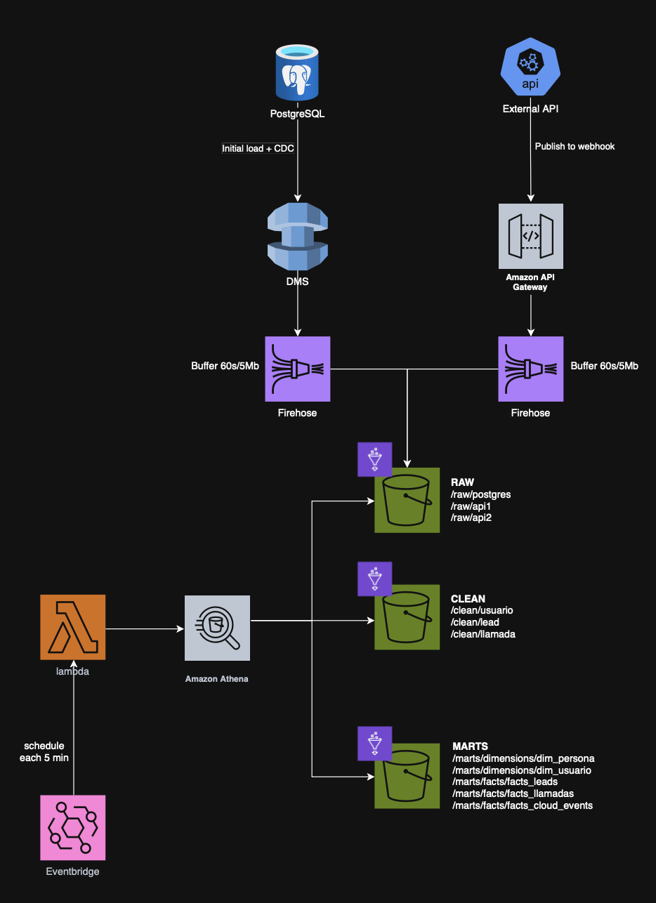
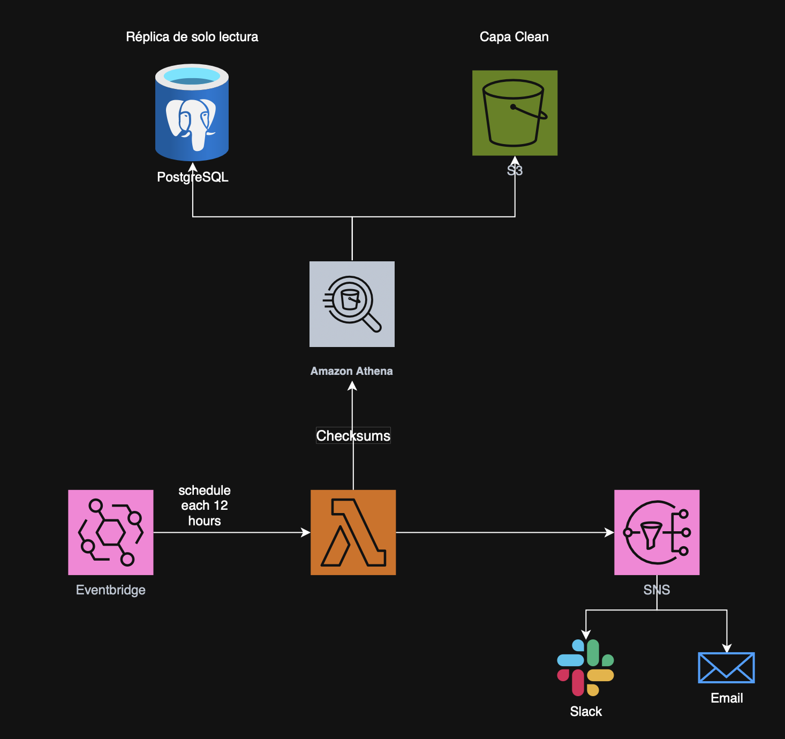

# Nebula - Data Lake Architecture (spanish)

## 📂 Contents

* **[Part 1: Technical Challenge](#part-1-technical-challenge)**
* **[Part 2: Data Lake Architecture](#part-2-data-lake-architecture)**
  * [1. Infraestructura (IaC)](#1-infraestructura-iac)
  * [2. Ingesta (CDC)](#2-ingesta-cdc)
  * [3. Multi-fuente](#3-multi-fuente)
  * [4. Gobierno y confianza](#4-gobierno-y-confianza)

---

## Part 1: Technical Challenge

* **[`challenge/`](challenge/)**
  * Proyecto en Python utilizando la librería **Polars** para calcular las agregaciones:
    - Leads por día
    - Tasa de conversión
    - Llamadas efectivas por día
    - Llamadas efectivas por agente
---

## Part 2: Data Lake Architecture

### 🗺️ Diagrama de Arquitectura


### 1. Infraestructura (IaC)

Esta sección detalla los componentes de AWS necesarios para desplegar esta arquitectura mediante **Infraestructura como Código (IaC)**, utilizando herramientas como Terraform, AWS CloudFormation o AWS CDK. Se han incluido los servicios de red, seguridad, orquestación y monitoreo que no aparecen explícitamente en el diagrama de arquitectura pero que son indispensables para un entorno productivo.

| Categoría | Servicio de AWS | Función en la Arquitectura | Enfoque de IaC / Eficiencia |
| :--- | :--- | :--- | :--- |
| **Almacenamiento** | **Amazon S3** | Foundation del Data Lake. Almacenamiento desacoplado en capas: *Raw* (JSON), *Clean* (Iceberg) y *Marts* (Iceberg). | Bajo coste (~$0.023/GB). Se definen políticas de ciclo de vida (Lifecycle Rules) vía IaC para mover datos antiguos a Glacier. |
| **Ingesta** | **AWS DMS** | Réplica de datos desde PostgreSQL (carga inicial + CDC continuo). | Se definen `ReplicationInstances`, `SourceEndpoints`, `TargetEndpoints` y `ReplicationTasks` en código. Lee logs transaccionales asíncronamente. |
| | **Amazon API Gateway** | Expone endpoints públicos HTTPS para webhooks externos. | Integración directa de servicio (*Service Integration*) hacia Firehose definida en VTL vía IaC, sin Lambda intermedia. |
| | **Amazon Kinesis Firehose** | Entrega continua y agrupada (*buffering*) de eventos hacia S3 Raw. | Evita el *"Small Files Problem"* agrupando por tiempo (60s) o tamaño (5MB). |
| **Computo** | **Amazon Athena** | Motor de consultas SQL Serverless para ELT y MERGE sobre Iceberg. | Sustituye a AWS Glue Spark Jobs. Se definen `Workgroups` vía IaC para controlar costes y aislar cargas de trabajo. Se paga por TB escaneado. |
| | **AWS Lambda** | Orquestación ligera de transformaciones Athena (programada en Rust). | Cómputo serverless con coste por milisegundo de ejecución. Se despliega el paquete de código y variables de entorno vía IaC. |
| **Gobierno y Metadatos** | **AWS Glue Data Catalog** | Catálogo centralizado de metadatos, esquemas e histórico de Iceberg. | Gobierno Serverless. Se definen `Databases` y `Tables` (DDL Iceberg) iniciales vía IaC. |
| | **AWS Lake Formation** | Control de acceso granular (fila/columna) unificado sobre el Glue Catalog. | Se definen permisos de IAM y políticas de Lake Formation en código para seguridad unificada. |
| **Red (Network)** | **Amazon VPC** | Aislamiento de red para DMS y orígenes de datos privados. | IaC define Subnets, Route Tables, Internet Gateways y NAT Gateways. |
| | **VPC Endpoints (Gateway/Interface)** | Permite que DMS y Lambda se comuniquen de forma privada con S3, Athena y Glue sin salir a la internet pública. | IaC configura `vpce` para S3, Glue y Athena, mejorando seguridad y costes de tráfico. |
| **Seguridad y Cifrado** | **AWS IAM** | Gestión de identidades y roles para permisos entre servicios. | IaC define roles mínimos necesarios (p.ej., rol para que Firehose escriba en S3). |
| | **AWS KMS** | Gestión de claves de cifrado en reposo para S3, Kinesis y Athena. | Se define una *Customer Managed Key (CMK)* vía IaC para cifrado homogeneizado. |
| **Orquestación y Eventos** | **Amazon EventBridge** | Planificador serverless (*Cron job*) que dispara la Lambda cada 5 minutos. | Se define una `Rule` y un `Target` (la Lambda) en el código IaC. |
| **Monitoreo y Logs** | **Amazon CloudWatch** | Centraliza métricas (latencia, fallos) y logs de DMS, Firehose, Lambda y Athena. | IaC configura `LogGroups` y `Alarms` (p.ej., alerta si DMS tiene alto lag). |
| **Visualización** | **Amazon QuickSight** | Herramienta de BI para consumo de la Capa Marts. | Se paga por autor/usuario sesión. La conexión a Athena se puede configurar vía IaC (CDK). |

### 2. Ingesta (CDC)

### 2.1. Metodología de Ingesta

**Fuentes de datos - PostgreSQL**
Se utiliza AWS DMS configurado con una tarea de tipo CDC (Change Data Capture) combinada con el parámetro BufferInSeconds=60 y BufferSize=5.
*   **Fase Initial:** Copia masiva inicial de datos históricos.
*   **Fase CDC:** Escucha continua del WAL (wal_level = logical) de PostgreSQL para capturar mutaciones en tiempo real.

**Fuentes de Terceros - APIS**
Para integrar las APIs externas sin incurrir en costes de servidores 24/7, se configura una integración nativa en API Gateway. Las peticiones HTTP POST entrantes en el webhook se validan y se envían a Kinesis Firehose usando plantillas de mapeo VTL, sin usar Lambda intermedia para reducir latencia y coste.

### 2.2. Capa Raw (Bronce) - Ingesta Multifuente Inmutable
Almacena una copia exacta, cruda, inmutable y *append-only* de todos los orígenes de datos sin transformaciones. Aísla el impacto en los sistemas de origen y permite la reejecución completa de pipelines analíticos en caso de fallo.

* **Formato de archivo:** **JSON** (para eventos de base de datos y APIs).
* **Almacenamiento Físico:** Ficheros de texto plano organizados por ráfagas de tiempo generados por Firehose.

> ⚠️ **Decisión crítica de diseño (Evitando el "Small Files Problem"):** Se descarta almacenar en Parquet directo desde DMS o Firehose en esta capa. Como el CDC e inyectan eventos continuamente, escribir Parquet directamente generaría miles de archivos de pocos Kilobytes (debido a su estructura interna de bloques). Esto degradaría el rendimiento de Athena. JSON tolera cambios dinámicos de esquemas y permite que Firehose realice un *buffering* óptimo (5MB / 60s).

### 🚫 Descarte de Apache Kafka / AWS MSK
Se evaluó y descartó la inclusión de Apache Kafka en favor de **Kinesis Firehose + Athena** debido a tres factores críticos:
* **Eficiencia en Costes (Filosofía Serverless):** Kafka requiere clústeres aprovisionados con coste fijo 24/7. La arquitectura actual es 100% serverless: si no hay tráfico, el coste es casi cero.
* **Carga de Mantenimiento:** Delegar la administración de la ingesta en Kinesis Firehose elimina la carga operativa de gestionar brokers, particiones y zookeeper.
* **Alineación con el Caso de Uso (Data Lake Analítico):** Kafka brilla en reactividad en milisegundos. Para un Data Lake de BI, una latencia de consolidación de 5 minutos (*near real-time*) es óptima. Introducir Kafka habría supuesto una sobreingeniería injustificada.

**Organización del particionado estilo Hive en S3 (`capa raw bucket`):**
```text
raw/
├── postgres/              # Fuente Transaccional Estructurada (via AWS DMS CDC)
│   ├── lead/
│   ├── llamada/
│   └── usuario/
│       └── year=2026/month=07/day=18/hour=19/
│           └── dms-cdc-file-102.json
├── api_externa_1/         # Fuente Semiestructurada en Streaming (via API Gateway)
│   └── eventos/
│       └── year=2026/month=07/day=18/hour=19/
│           └── firehose-api-stream-1-2026-07-18...json
└── api_externa_1/       # Extensibilidad: Nueva fuente batch aislada de forma nativa
    └── eventos/
        └── year=2026/month=07/day=19/hour=09/
            └── batch-ingest-01.json
```

### 2.3. Capa Clean (Silver) - Consolidación ACID
Mantiene una única versión consistente, tipada, limpia y reconciliada de cada entidad de negocio, independientemente de su origen.

* **Formato de tabla:** **Apache Iceberg**.
* **Almacenamiento Físico:** Archivos columnares en **Parquet** comprimidos con **Snappy** (`.parquet.snappy`).

**Orquestación y Computo (¿Cómo funciona la Lambda?):**
Se descartan los AWS Glue Spark Jobs continuos por su alto coste fijo. Se utiliza un enfoque **ELT Serverless** optimizado:

1.  **Orquestación:** Amazon EventBridge despierta una función **Lambda (programada en Rust** para máximo rendimiento) cada 5 minutos.
2.  **Ejecución:** La Lambda no procesa los datos; simplemente invoca la API asíncrona de Amazon Athena para ejecutar comandos SQL `MERGE` e `INSERT`.
3.  **¿Cómo sabe qué carpeta consultar?**
    *   **Definición de Tabla:** Durante la fase IaC de DDL (`CREATE EXTERNAL TABLE`), se define explícitamente el parámetro `LOCATION` apuntando al prefijo de S3 Raw correspondiente. Athena consulta el Glue Catalog para saber dónde leer.
    *   **SQL MERGE:** El script SQL orquestado por la Lambda define el flujo: `MERGE INTO capa_clean.usuario TARGET USING capa_raw.usuario_updates SOURCE ...`. Athena traduce estos nombres de tabla a rutas físicas de S3 (Raw para leer, Clean para escribir via Iceberg) consultando el catálogo.

**Organización del particionado Iceberg en S3 (`capa clean bucket`):**
```text
clean/
├── usuario/                      # Entidad unificada (Postgres + APIs)
│   ├── metadata/                 # Archivos de control de transacciones ACID
│   └── data/                     # Ficheros físicos en Parquet Columnar + Snappy
│       └── year=2026/month=07/day=18/
│           ├── 4a8b2c1d-data.parquet.snappy
├── lead/
├── llamada/
```

### 2.4. Capa Marts (Gold) - Modelado Analítico
Contiene modelos de datos de alto rendimiento optimizados para consumo directo por herramientas de BI como **Amazon QuickSight**.

#### 🛠️ Especificaciones Técnicas
* **Formato de tabla:** **Apache Iceberg** (respaldado por archivos Parquet comprimidos con Snappy).
* **Enfoque de Diseño:** Modelado Dimensional en **Estrella / Copo de Nieve** para garantizar consultas SQL sencillas, intuitivas y ultra rápidas.

#### ⚙️ Orquestación y Estrategia de Cómputo
Al igual que en la capa Clean, se implementa un enfoque **ELT Serverless** para mantener el control estricto de costes:

* **Disparador:** La función **AWS Lambda** (orquestada por EventBridge cada 5 minutos junto al pipeline principal) gestiona la ejecución.
* **Procesamiento:** La Lambda invoca de manera asíncrona a **Amazon Athena** para ejecutar sentencias `INSERT INTO` masivas.
* **Transformación:** En esta etapa se realizan los *Joins* definitivos entre las tablas de la capa *Clean*, se aplica la lógica de negocio, el cálculo de métricas, la generación de claves subrogadas y las reglas de dimensionalidad (como SCD Tipo 2).

#### 📂 Estructura de Almacenamiento en S3 (`capa marts bucket`)
Los datos se organizan físicamente en subcarpetas separadas según su propósito dimensional para coincidir con el diagrama de arquitectura:

```text
marts/
├── dimensions/                 # Dimensiones: Tablas de contexto (Entidades)
│   ├── dim_persona/
│   │   ├── metadata/
│   │   └── data/
│   └── dim_usuario/
│       ├── metadata/
│       └── data/
└── facts/                      # Hechos: Tablas de métricas y eventos cuantitativos
    ├── facts_leads/
    ├── facts_llamadas/
    └── facts_cloud_events/     # Extensibilidad: Nuevas métricas de negocio
```

### 3. Multi-fuente
El Data Lake está diseñado unificando la ingesta de bases de datos relacionales y webhooks de terceros.

**Si mañana llega una nueva fuente distinta (p. ej. eventos de proveedor cloud o ficheros batch), ¿cómo la integrarías?**
Gracias al desacoplamiento de componentes y formatos abiertos, la inclusión se resuelve de manera nativa en 3 pasos:

1.  **Capa Raw (Bronce): Ingesta:**
    *   **Si son ficheros en S3 (Batch):** Se configura réplica de bucket o regla de eventos S3 -> Lambda -> Nuevo prefijo (ej: `raw/api_externa_1/`).
    *   **Si son eventos Cloud (Streaming):** Se expone nuevo endpoint en **API Gateway** existente. Usando VTL, se redirige a un nuevo stream de **Firehose**.
2.  **Capa Clean (Silver): Unificación:**
    Se crea la definición de tabla en el **Glue Catalog** apuntando al nuevo prefijo Raw. Se extiende la lógica de la función Lambda orquestadora (programada en Rust) para incluir la nueva transformación SQL en Athena que popula una tabla Iceberg Silver.
3.  **Capa Marts (Gold): Modelado:**
    Al ser todas tablas Iceberg consultables desde Athena, Herramientas de BI como **QuickSight** pueden cruzar los datos de ambas fuentes de manera transparente a través de relaciones `JOIN` en consultas SQL, abstrayendo la complejidad al usuario final.

### 4. Gobierno y confianza

#### 🔍 1. Descuadres de Cifras: Causas Potenciales
Si las métricas del Data Lake no coinciden con producción, el origen suele ser:
* **Latencia de Consolidación:** CDC es inmediato a Raw, pero Silver se actualiza cada 5 minutos.
* **Duplicidad de Eventos:** Kinesis Firehose garantiza entrega *At-Least-Once*. Ante reintentos de red, puede duplicar registros en Raw. La lógica `MERGE` en Silver debe deduplicar usando marcas de tiempo (`metadata.timestamp`).
* **Borrados Físicos:** Si la aplicación hace `DELETE` físico y la tarea DMS o el SQL `MERGE` en Athena ignora ese evento, el Data Lake mantendrá registros "fantasma".

#### 🧪 2. Estrategia de Reconciliación Automática



#### 📜 3. Trazabilidad Histórica
Para responder a auditorías (ej: "¿En qué estado estaba este Lead el 1 de marzo?") hay dos opciones:
1.  **SCD Tipo 2 (Modelado Dimensional):** Transformaciones SQL gestionan columnas de validez temporal (`fecha_inicio`, `fecha_fin`, `is_active`) en Marts.
2.  **Iceberg Time Travel (Nativo en Silver):** Apache Iceberg conserva snapshots. Es posible interrogar al Data Lake usando SQL nativo en Athena especificando un momento del pasado:

```sql
-- Ejemplo de consulta el estado de una tabla y como estaba el 1 de Marzo
SELECT * 
FROM capa_clean.usuario 
FOR SYSTEM_TIME AS OF TIMESTAMP '2026-03-01 00:00:00 UTC';
```

----
# Nebula - Data Lake Architecture (english)

## 📂 Contents

* **[Part 1: Technical Challenge solution](#part-1-technical-challenge-solution)**
* **[Part 2: Data Lake Architecture design](#part-2-data-lake-architecture-design)**
  * [1. Infrastructure](#1-infrastructure)
  * [2. Ingestion](#2-ingestion)
  * [3. Multi-source-solution](#3-multi-source-solution)
  * [4. Governance and trust](#4-governance-and-trust)

---

## Part 1: Technical Challenge solution

* **[`challenge/`](challenge/)**
  * Python project using the **Polars** library to calculate aggregations:
    - Leads per day
    - Conversion rate
    - Effective calls per day
    - Effective calls per agent
---

## Part 2: Data Lake Architecture design

### 🗺️ Architecture Diagram


### 1. Infrastructure

This section details the AWS components required to deploy this architecture using **Infrastructure as Code (IaC)**, leveraging tools such as Terraform, AWS CloudFormation, or AWS CDK. Networking, security, orchestration, and monitoring services that do not appear explicitly in the architecture diagram but are indispensable for a production environment have been included.

| Category | AWS Service | Role in the Architecture | IaC Approach / Efficiency |
| :--- | :--- | :--- | :--- |
| **Storage** | **Amazon S3** | Data Lake Foundation. Decoupled storage in layers: *Raw* (JSON), *Clean* (Iceberg), and *Marts* (Iceberg). | Low cost (~$0.023/GB). Lifecycle Rules are defined via IaC to move old data to Glacier. |
| **Ingestion** | **AWS DMS** | Data replication from PostgreSQL (initial load + continuous CDC). | `ReplicationInstances`, `SourceEndpoints`, `TargetEndpoints`, and `ReplicationTasks` are defined in code. Reads transactional logs asynchronously. |
| | **Amazon API Gateway** | Exposes public HTTPS endpoints for external webhooks. | Direct service integration (*Service Integration*) to Firehose defined in VTL via IaC, without intermediate Lambda. |
| | **Amazon Kinesis Firehose** | Continuous and buffered delivery of events to S3 Raw. | Avoids the *"Small Files Problem"* by buffering by time (60s) or size (5MB). |
| **Compute** | **Amazon Athena** | Serverless SQL query engine for ELT and MERGE over Iceberg. | Replaces AWS Glue Spark Jobs. `Workgroups` are defined via IaC to control costs and isolate workloads. Charged per TB scanned. |
| | **AWS Lambda** | Lightweight orchestration of Athena transformations (programmed in Rust). | Serverless compute with cost per millisecond of execution. The code package and environment variables are deployed via IaC. |
| **Governance & Metadata** | **AWS Glue Data Catalog** | Centralized catalog for Iceberg metadata, schemas, and history. | Serverless Governance. Initial `Databases` and `Tables` (Iceberg DDL) are defined via IaC. |
| | **AWS Lake Formation** | Unified granular access control (row/column) over the Glue Catalog. | IAM permissions and Lake Formation policies are defined in code for unified security. |
| **Network** | **Amazon VPC** | Network isolation for DMS and private data sources. | IaC defines Subnets, Route Tables, Internet Gateways, and NAT Gateways. |
| | **VPC Endpoints (Gateway/Interface)** | Allows DMS and Lambda to communicate privately with S3, Athena, and Glue without leaving the public internet. | IaC configures `vpce` for S3, Glue, and Athena, improving security and reducing traffic costs. |
| **Security & Encryption** | **AWS IAM** | Identity and role management for cross-service permissions. | IaC defines the minimum required roles (e.g., role for Firehose to write to S3). |
| | **AWS KMS** | Management of encryption keys at rest for S3, Kinesis, and Athena. | A *Customer Managed Key (CMK)* is defined via IaC for homogenized encryption. |
| **Orchestration & Events** | **Amazon EventBridge** | Serverless scheduler (*Cron job*) that triggers the Lambda every 5 minutes. | A `Rule` and a `Target` (the Lambda) are defined in the IaC code. |
| **Monitoring & Logs** | **Amazon CloudWatch** | Centralizes metrics (latency, failures) and logs from DMS, Firehose, Lambda, and Athena. | IaC configures `LogGroups` and `Alarms` (e.g., alert if DMS has high lag). |
| **Visualization** | **Amazon QuickSight** | BI tool for consuming the Marts Layer. | Paid per author/user session. The connection to Athena can be configured via IaC (CDK). |

### 2. Ingestion

### 2.1. Ingestion Methodology

**Data Sources - PostgreSQL**
AWS DMS is used, configured with a CDC (Change Data Capture) task combined with the parameter BufferInSeconds=60 and BufferSize=5.
*   **Initial Phase:** Bulk initial copy of historical data.
*   **CDC Phase:** Continuous listening to the PostgreSQL WAL (wal_level = logical) to capture real-time mutations.

**Third-Party Sources - APIs**
To integrate external APIs without incurring 24/7 server costs, a native integration is configured in API Gateway. Incoming HTTP POST requests on the webhook are validated and sent to Kinesis Firehose using VTL mapping templates, bypassing intermediate Lambdas to reduce latency and cost.

### 2.2. Raw Layer (Bronze) - Immutable Multi-Source Ingestion
Stores an exact, raw, immutable, and *append-only* copy of all data sources without transformations. It isolates the impact on source systems and allows complete re-execution of analytical pipelines in case of failure.

* **File Format:** **JSON** (for database and API events).
* **Physical Storage:** Plain text files organized by time bursts generated by Firehose.

> ⚠️ **Critical Design Decision (Avoiding the "Small Files Problem"):** Storing directly in Parquet from DMS or Firehose in this layer is ruled out. Since CDC continuously injects events, writing Parquet directly would generate thousands of few-kilobyte files (due to its internal block structure). This would degrade Athena's performance. JSON treats dynamic schema changes and allows Firehose to perform optimal buffering (5MB / 60s).

### 🚫 Rejection of Apache Kafka / AWS MSK
The inclusion of Apache Kafka was evaluated and discarded in favor of **Kinesis Firehose + Athena** due to three critical factors:
* **Cost Efficiency (Serverless Philosophy):** Kafka requires provisioned clusters with a fixed 24/7 cost. The current architecture is 100% serverless: if there is no traffic, the cost is almost zero.
* **Maintenance Burden:** Delegating ingestion management to Kinesis Firehose eliminates the operational burden of managing brokers, partitions, and zookeeper.
* **Alignment with the Use Case (Analytical Data Lake):** Kafka excels in millisecond responsiveness. For a BI Data Lake, a consolidation latency of 5 minutes (*near real-time*) is optimal. Introducing Kafka would have meant unjustified over-engineering.

**Hive-style partitioning organization in S3 (`capa raw`):**
```text
raw/
├── postgres/              # Structured Transactional Source (via AWS DMS CDC)
│   ├── lead/
│   ├── llamada/
│   └── usuario/
│       └── year=2026/month=07/day=18/hour=19/
│           └── dms-cdc-file-102.json
├── api_externa_1/         # Semi-structured Streaming Source (via API Gateway)
│   └── eventos/
│       └── year=2026/month=07/day=18/hour=19/
│           └── firehose-api-stream-1-2026-07-18...json
└── api_externa_1/       # Extensibility: New batch source natively isolated
    └── eventos/
        └── year=2026/month=07/day=19/hour=09/
            └── batch-ingest-01.json
```

### 2.3. Clean Layer (Silver) - ACID Consolidation
Maintains a single consistent, typed, clean, and reconciled version of each business entity, regardless of its origin.

* **Table Format:** **Apache Iceberg**.
* **Physical Storage:** Columnar files in **Parquet** compressed with **Snappy** (`.parquet.snappy`).

**Orchestration and Compute (How does the Lambda work?):**
Continuous AWS Glue Spark Jobs are discarded due to their high fixed cost. An optimized **Serverless ELT** approach is used:

1.  **Orchestration:** Amazon EventBridge wakes up a **Lambda function (programmed in Rust** for maximum performance) every 5 minutes.
2.  **Execution:** The Lambda does not process the data; it simply invokes the Amazon Athena asynchronous API to execute `MERGE` and `INSERT` SQL commands.
3.  **How does it know which folder to query?**
    *   **Table Definition:** During the DDL IaC phase (`CREATE EXTERNAL TABLE`), the `LOCATION` parameter is explicitly defined pointing to the corresponding S3 Raw prefix. Athena queries the Glue Catalog to know where to read.
    *   **SQL MERGE:** The SQL script orchestrated by the Lambda defines the flow: `MERGE INTO capa_clean.usuario TARGET USING capa_raw.usuario_updates SOURCE ...`. Athena translates these table names into physical S3 paths (Raw to read, Clean to write via Iceberg) by querying the catalog.

**Iceberg partitioning organization in S3 (`capa clean bucket`):**
```text
clean/
├── usuario/                      # Unified entity (Postgres + APIs)
│   ├── metadata/                 # ACID transaction control files
│   └── data/                     # Physical files in Columnar Parquet + Snappy
│       └── year=2026/month=07/day=18/
│           ├── 4a8b2c1d-data.parquet.snappy
├── lead/
├── llamada/
```

### 2.4. Marts Layer (Gold) - Analytical Modeling
Contains high-performance data models optimized for direct consumption by BI tools such as **Amazon QuickSight**.

#### 🛠️ Technical Specifications
* **Table Format:** **Apache Iceberg** (backed by Parquet files compressed with Snappy).
* **Design Approach:** Dimensional Modeling in **Star / Snowflake** to ensure simple, intuitive, and ultra-fast SQL queries.

#### ⚙️ Orchestration and Compute Strategy
As in the Clean layer, a **Serverless ELT** approach is implemented to maintain strict cost control:

* **Trigger:** The **AWS Lambda** function (orchestrated by EventBridge every 5 minutes along with the main pipeline) manages execution.
* **Processing:** The Lambda asynchronously invokes **Amazon Athena** to execute bulk `INSERT INTO` statements.
* **Transformation:** In this stage, the final *Joins* between the tables of the *Clean* layer are performed, business logic is applied, metrics are calculated, surrogate keys are generated, and dimensionality rules (such as SCD Type 2) are enforced.

#### 📂 Storage Structure in S3 (`capa marts bucket`)
Data is physically organized into separate subfolders according to their dimensional purpose to match the architecture diagram:

```text
marts/
├── dimensions/                 # Dimensions: Context tables (Entities)
│   ├── dim_persona/
│   │   ├── metadata/
│   │   └── data/
│   └── dim_usuario/
│       ├── metadata/
│       └── data/
└── facts/                      # Facts: Metric tables and quantitative events
    ├── facts_leads/
    ├── facts_llamadas/
    └── facts_cloud_events/     # Extensensibility: New business metrics
```

### 3. Multi-source solution
The Data Lake is designed by unifying the ingestion of relational databases and third-party webhooks.

**If a new, different source arrives tomorrow (e.g., cloud provider events or batch files), how would you integrate it?**
Thanks to the decoupling of components and open formats, inclusion is handled natively in 3 steps:

1.  **Raw Layer (Bronze): Ingestion:**
    *   **If they are files in S3 (Batch):** A bucket replication or S3 event rule -> Lambda -> New prefix (e.g., `raw/api_externa_1/`) is configured.
    *   **If they are Cloud events (Streaming):** A new endpoint is exposed in the existing **API Gateway**. Using VTL, it is redirected to a new **Firehose** stream.
2.  **Clean Layer (Silver): Unification:**
    The table definition is created in the **Glue Catalog** pointing to the new Raw prefix. The logic of the orchestrator Lambda function (programmed in Rust) is extended to include the new SQL transformation in Athena that populates a Silver Iceberg table.
3.  **Marts Layer (Gold): Modeling:**
    Since all tables are Iceberg queryable from Athena, BI tools like **QuickSight** can cross-reference data from both sources seamlessly via `JOIN` relations in SQL queries, abstracting complexity away from the end user.

### 4. Governance and trust

#### 🔍 1. Figure Mismatches: Potential Causes
If Data Lake metrics do not match production, the cause is usually:
* **Consolidation Latency:** CDC is immediate to Raw, but Silver updates every 5 minutes.
* **Event Duplication:** Kinesis Firehose guarantees *At-Least-Once* delivery. Under network retries, it may duplicate records in Raw. The `MERGE` logic in Silver must deduplicate using timestamps (`metadata.timestamp`).
* **Physical Deletions:** If the application performs a physical `DELETE` and the DMS task or the Athena `MERGE` SQL ignores that event, the Data Lake will retain "phantom" records.

#### 🧪 2. Automated Reconciliation Strategy


#### 📜 3. Historical Traceability
To respond to audits (e.g., "What state was this Lead in on March 1st?") there are two options:
1.  **SCD Type 2 (Dimensional Modeling):** SQL transformations manage time-validity columns (`fecha_inicio`, `fecha_fin`, `is_active`) in Marts.
2.  **Iceberg Time Travel (Native in Silver):** Apache Iceberg preserves snapshots. It is possible to query the Data Lake using native SQL in Athena specifying a moment in the past:

```sql
-- Example of querying the state of a table as it was on March 1st
SELECT * 
FROM capa_clean.usuario 
FOR SYSTEM_TIME AS OF TIMESTAMP '2026-03-01 00:00:00 UTC';
```